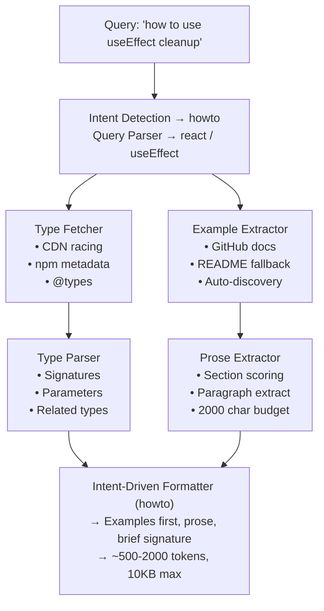

A next-generation framework documentation provider for Claude Code via Model Context Protocol (MCP). Returns **types + prose + examples** with context-aware formatting for **any** npm package — not just curated ones.

mcp-name: dev.augments/mcp

## What's New in v5

**Version 5.0** closes the gap with context7 by adding prose documentation, README fallback, concept search, and intent-aware formatting — while keeping the type-signature accuracy that made v4 unique.

| v4 | v5 |
|----|-----|
| Type signatures only | Types + prose + examples |
| ~20 curated frameworks | Any npm package (auto-discovery) |
| Keyword-only search | Concept synonyms ("state" → useState, createStore, atom) |
| One-size-fits-all format | Intent-aware (how-to vs reference vs migration) |
| 7 tools (4 legacy) | 3 focused tools |

### What You Get Now

```
Query: "how to use zustand"
→ Intent: howto
→ Code examples first, then prose explanation, then brief signature

Query: "useEffect signature"
→ Intent: reference
→ Full signature, parameters, return type, related types, 1 example

Query: "ioredis set"
→ README fallback provides examples for uncurated packages
```

## Quick Start

### Option 1: Hosted MCP Server (Recommended)

```bash
# Add the hosted MCP server
claude mcp add --transport http augments https://mcp.augments.dev/mcp

# Verify configuration
claude mcp list
```

### Option 2: Using Cursor

```json
{
  "mcpServers": {
    "augments": {
      "transport": "http",
      "url": "https://mcp.augments.dev/mcp"
    }
  }
}
```

### Usage

```
# Get API context with prose + examples (recommended first tool to try)
@augments get_api_context query="useEffect cleanup" framework="react"

# How-to format — examples first
@augments get_api_context query="how to use zustand"

# Reference format — full signature first
@augments get_api_context query="zod object signature"

# Search for APIs by concept (synonym-aware)
@augments search_apis query="state management"

# Get version information and breaking changes
@augments get_version_info framework="react" fromVersion="18" toVersion="19"
```

## Tools

| Tool | Description |
|------|-------------|
| `get_api_context` | **Primary tool.** Returns API signatures, prose documentation, and code examples for any npm package. Handles natural language queries with intent detection. |
| `search_apis` | Search for APIs across frameworks by keyword or concept. Supports synonym expansion ("state" matches useState, createStore, atom, etc). |
| `get_version_info` | Get npm version info, compare versions, and detect breaking changes. |

## Architecture



### Source Structure

```
src/
├── core/                    # Core modules
│   ├── query-parser.ts      # Parse natural language → framework + concept
│   ├── type-fetcher.ts      # Fetch .d.ts + README from npm/unpkg/jsdelivr
│   ├── type-parser.ts       # Parse TypeScript, extract signatures, synonym search
│   ├── example-extractor.ts # Fetch examples from GitHub docs + auto-discovery
│   └── version-registry.ts  # npm registry integration
├── tools/v4/                # MCP tools
│   ├── get-api-context.ts   # Primary tool (types + prose + examples)
│   ├── search-apis.ts       # Cross-framework API search
│   └── get-version-info.ts  # Version comparison
├── cache/                   # In-memory LRU cache
└── server.ts                # MCP server (3 tools)
```

## Key Features

### Concept Synonyms
"state management" matches `useState`, `useReducer`, `createStore`, `atom`, `signal`, `ref`, `reactive`, `writable`, `store`. Eight concept clusters cover state, form, fetch, animation, routing, auth, cache, and effect patterns.

### README Fallback
For the 99%+ of npm packages without curated documentation sources, augments fetches `README.md` from the CDN and extracts concept-relevant code blocks and prose.

### Auto-Discovery
When no curated doc source exists, augments parses the npm `repository` field, identifies the GitHub repo, and probes for `docs/`, `documentation/`, `doc/`, or `README.md`.

### Intent-Aware Formatting
| Intent | Trigger | Format |
|--------|---------|--------|
| `howto` | "how to", "example of", "guide" | Examples → prose → brief signature |
| `reference` | "signature", "types", "parameters" | Full signature → related types → 1 example |
| `migration` | "migrate", "upgrade", "breaking" | Prose → signature → examples |
| `balanced` | Default | Signature → prose → examples |

## Supported Frameworks

### Auto-Discovery (Any npm Package)
Any npm package with TypeScript types can be queried — no configuration needed:
- Bundled types (`"types": "./dist/index.d.ts"` in package.json)
- DefinitelyTyped (`@types/package-name`)
- README fallback for packages without types

### Optimized with Curated Docs (22 Frameworks)
React, Next.js, Vue, Prisma, Zod, Supabase, TanStack Query, tRPC, React Hook Form, Framer Motion, Express, Zustand, Jotai, Drizzle, SWR, Vitest, Playwright, Fastify, Hono, Solid, Svelte, Angular, Redux

### Barrel Export Handling
Special sub-module resolution for: React Hook Form, TanStack Query, Zustand, Jotai, tRPC, Drizzle ORM, Next.js

## Self-Hosting

### Deploy to Vercel

[](https://vercel.com/new/clone?repository-url=https://github.com/augmnt/augments-mcp-server)

### Local Development

```bash
# Clone and install
git clone https://github.com/augmnt/augments-mcp-server.git
cd augments-mcp-server
npm install

# Run development server
npm run dev

# Run tests
npm test

# Type check
npm run type-check

# Build
npm run build
```

## How v5 Compares to Context7

| Aspect | Context7 | Augments v5 |
|--------|----------|-------------|
| **Source** | Parsed prose docs | TypeScript definitions + prose + README |
| **Accuracy** | Docs can be wrong | Types must be correct, prose supplements |
| **Context size** | ~5-10KB chunks | ~500-2000 tokens (intent-aware) |
| **Coverage** | Manual submission | Any npm package (auto-discovery) |
| **Format** | One-size-fits-all | Intent-aware (how-to vs reference) |
| **Search** | Keyword match | Concept synonyms + keyword |
| **Freshness** | Crawl schedule | On-demand from npm |

## Contributing

1. Fork the repository
2. Create a feature branch: `git checkout -b feature/amazing-feature`
3. Make your changes
4. Run tests: `npm test`
5. Submit a pull request

## License

MIT License - see [LICENSE](LICENSE) for details.

## Support

- [GitHub Issues](https://github.com/augmnt/augments-mcp-server/issues)
- [GitHub Discussions](https://github.com/augmnt/augments-mcp-server/discussions)

---

**Built for the Claude Code ecosystem** | **Version 5.0.0**
