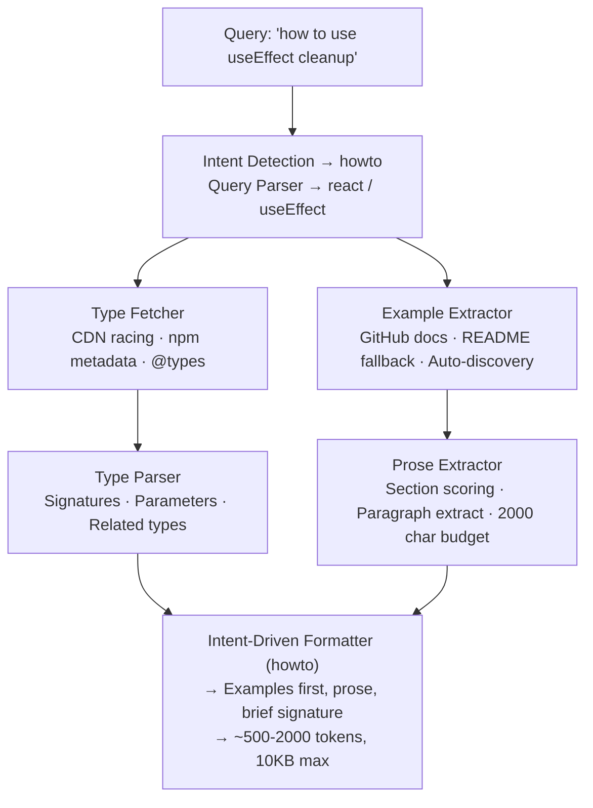

A next-generation framework documentation provider for Claude Code via Model Context Protocol (MCP). Returns **types + prose + examples** with context-aware formatting for **any** npm package — not just curated ones.

mcp-name: dev.augments/mcp

## What's New in v6

**Version 6.0** converts augments from a hosted HTTP service to a **local stdio MCP server** published on npm. No more remote calls — everything runs on your machine, faster and with zero hosting dependency.

| v5 | v6 |
|----|-----|
| Hosted HTTP on Vercel | Local stdio via npx |
| Remote network calls | Runs on your machine |
| Next.js runtime | Lightweight tsup bundle |
| Logs to stdout | Logs to stderr (stdio-safe) |

## Quick Start

### Claude Code

```bash
# Add the MCP server (runs locally via npx)
claude mcp add -s user augments -- npx -y @augmnt-sh/augments-mcp-server

# Verify configuration
claude mcp list
```

### Cursor

Add to your MCP config:

```json
{
  "mcpServers": {
    "augments": {
      "command": "npx",
      "args": ["-y", "augments-mcp-server"]
    }
  }
}
```

### Environment Variables

Set `GITHUB_TOKEN` for higher GitHub API rate limits when fetching examples:

```json
{
  "mcpServers": {
    "augments": {
      "command": "npx",
      "args": ["-y", "augments-mcp-server"],
      "env": {
        "GITHUB_TOKEN": "ghp_your_token_here"
      }
    }
  }
}
```

### Usage

```
# Get API context with prose + examples (recommended first tool to try)
@augments get_api_context query="useEffect cleanup" framework="react"

# How-to format — examples first
@augments get_api_context query="how to use zustand"

# Reference format — full signature first
@augments get_api_context query="zod object signature"

# Search for APIs by concept (synonym-aware)
@augments search_apis query="state management"

# Get version information and breaking changes
@augments get_version_info framework="react" fromVersion="18" toVersion="19"
```

## Tools

| Tool | Description |
|------|-------------|
| `get_api_context` | **Primary tool.** Returns API signatures, prose documentation, and code examples for any npm package. Handles natural language queries with intent detection. |
| `search_apis` | Search for APIs across frameworks by keyword or concept. Supports synonym expansion ("state" matches useState, createStore, atom, etc). |
| `get_version_info` | Get npm version info, compare versions, and detect breaking changes. |

## Architecture


```mermaid
flowchart TD
    A["Query: 'how to use useEffect cleanup'"] --> B

    B["Intent Detection → howto<br/>Query Parser → react / useEffect"]

    B --> C["Type Fetcher<br/>CDN racing · npm metadata · @types"]
    B --> D["Example Extractor<br/>GitHub docs · README fallback · Auto-discovery"]

    C --> E["Type Parser<br/>Signatures · Parameters · Related types"]
    D --> F["Prose Extractor<br/>Section scoring · Paragraph extract · 2000 char budget"]

    E --> G["Intent-Driven Formatter (howto)<br/>→ Examples first, prose, brief signature<br/>→ ~500-2000 tokens, 10KB max"]
    F --> G
```

### Source Structure

```
src/
├── cli.ts                   # stdio entry point
├── server.ts                # MCP server (3 tools)
├── core/                    # Core modules
│   ├── query-parser.ts      # Parse natural language → framework + concept
│   ├── type-fetcher.ts      # Fetch .d.ts + README from npm/unpkg/jsdelivr
│   ├── type-parser.ts       # Parse TypeScript, extract signatures, synonym search
│   ├── example-extractor.ts # Fetch examples from GitHub docs + auto-discovery
│   └── version-registry.ts  # npm registry integration
└── tools/v4/                # MCP tools
    ├── get-api-context.ts   # Primary tool (types + prose + examples)
    ├── search-apis.ts       # Cross-framework API search
    └── get-version-info.ts  # Version comparison
```

## Key Features

### Concept Synonyms
"state management" matches `useState`, `useReducer`, `createStore`, `atom`, `signal`, `ref`, `reactive`, `writable`, `store`. Eight concept clusters cover state, form, fetch, animation, routing, auth, cache, and effect patterns.

### README Fallback
For the 99%+ of npm packages without curated documentation sources, augments fetches `README.md` from the CDN and extracts concept-relevant code blocks and prose.

### Auto-Discovery
When no curated doc source exists, augments parses the npm `repository` field, identifies the GitHub repo, and probes for `docs/`, `documentation/`, `doc/`, or `README.md`.

### Intent-Aware Formatting
| Intent | Trigger | Format |
|--------|---------|--------|
| `howto` | "how to", "example of", "guide" | Examples → prose → brief signature |
| `reference` | "signature", "types", "parameters" | Full signature → related types → 1 example |
| `migration` | "migrate", "upgrade", "breaking" | Prose → signature → examples |
| `balanced` | Default | Signature → prose → examples |

## Coverage

### Any npm Package
Every npm package is supported out of the box — no curation or configuration needed. Augments resolves documentation automatically through three layers:

1. **TypeScript types** — bundled (`"types"` in package.json) or DefinitelyTyped (`@types/*`)
2. **Auto-discovered docs** — parses the npm `repository` field, finds the GitHub repo, and probes `docs/`, `documentation/`, `doc/` directories
3. **README fallback** — extracts concept-relevant code blocks and prose directly from `README.md`

This means augments works with the entire npm ecosystem (~2.5M packages), not just a curated subset.

### Enhanced Results for Popular Frameworks
22 frameworks have curated doc sources for richer examples: React, Next.js, Vue, Prisma, Zod, Supabase, TanStack Query, tRPC, React Hook Form, Framer Motion, Express, Zustand, Jotai, Drizzle, SWR, Vitest, Playwright, Fastify, Hono, Solid, Svelte, Angular, Redux

### Barrel Export Handling
Special sub-module resolution for: React Hook Form, TanStack Query, Zustand, Jotai, tRPC, Drizzle ORM, Next.js

## Local Development

```bash
# Clone and install
git clone https://github.com/augmnt/augments-mcp-server.git
cd augments-mcp-server
npm install

# Build with tsup
npm run build

# Run locally
npm start

# Watch mode
npm run dev

# Run tests
npm test

# Type check
npm run type-check
```

## How Augments Compares to Context7

| Aspect | Context7 | Augments |
|--------|----------|-------------|
| **Source** | Parsed prose docs | TypeScript definitions + prose + README |
| **Accuracy** | Docs can be wrong | Types must be correct, prose supplements |
| **Context size** | ~5-10KB chunks | ~500-2000 tokens (intent-aware) |
| **Coverage** | Manual submission | Any npm package (auto-discovery) |
| **Format** | One-size-fits-all | Intent-aware (how-to vs reference) |
| **Search** | Keyword match | Concept synonyms + keyword |
| **Freshness** | Crawl schedule | On-demand from npm |

## Contributing

1. Fork the repository
2. Create a feature branch: `git checkout -b feature/amazing-feature`
3. Make your changes
4. Run tests: `npm test`
5. Submit a pull request

## License

MIT License - see [LICENSE](LICENSE) for details.

## Support

- [GitHub Issues](https://github.com/augmnt/augments-mcp-server/issues)
- [GitHub Discussions](https://github.com/augmnt/augments-mcp-server/discussions)

---

**Built for the Claude Code ecosystem** | **Version 6.0.0**
